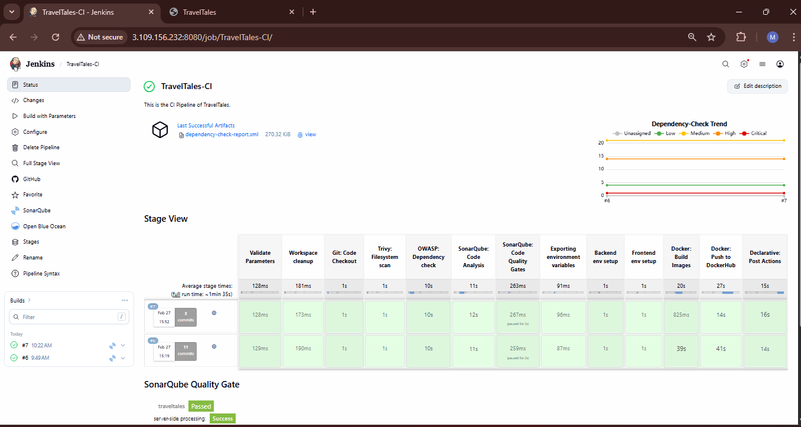
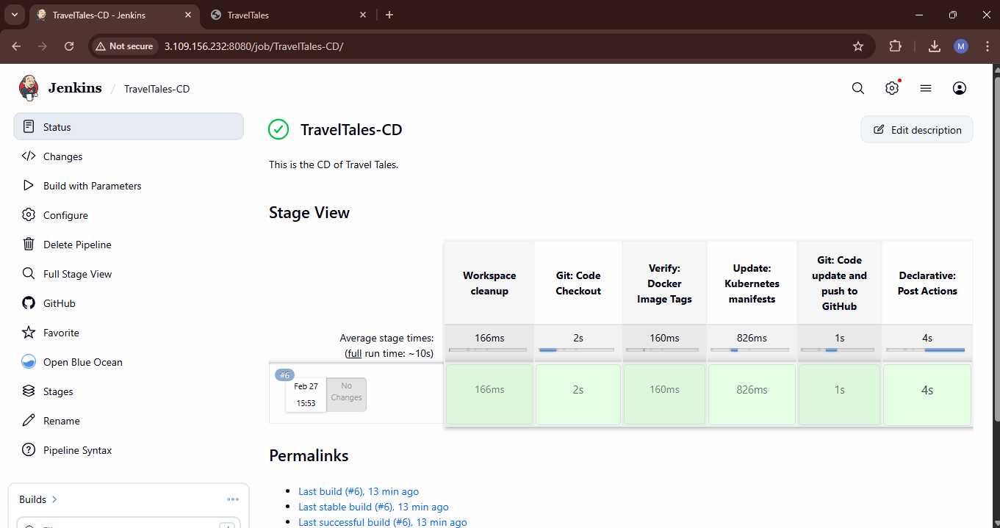
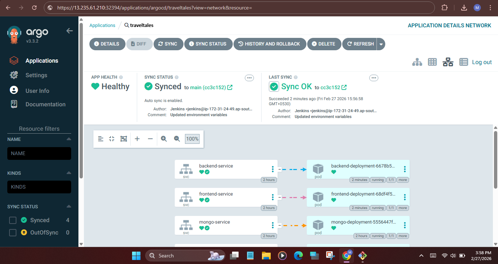
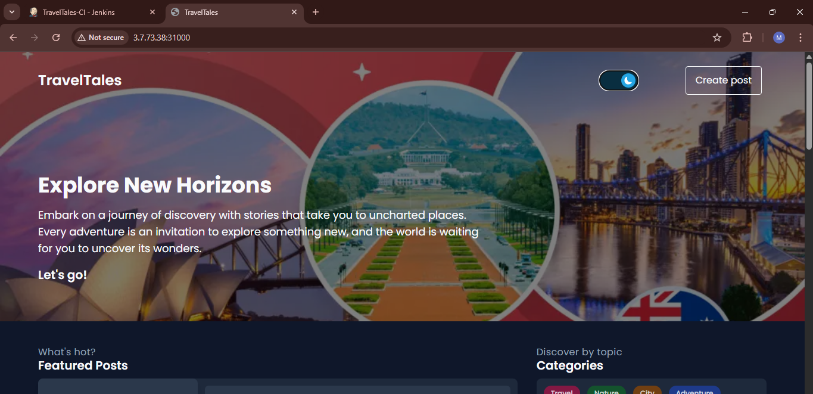
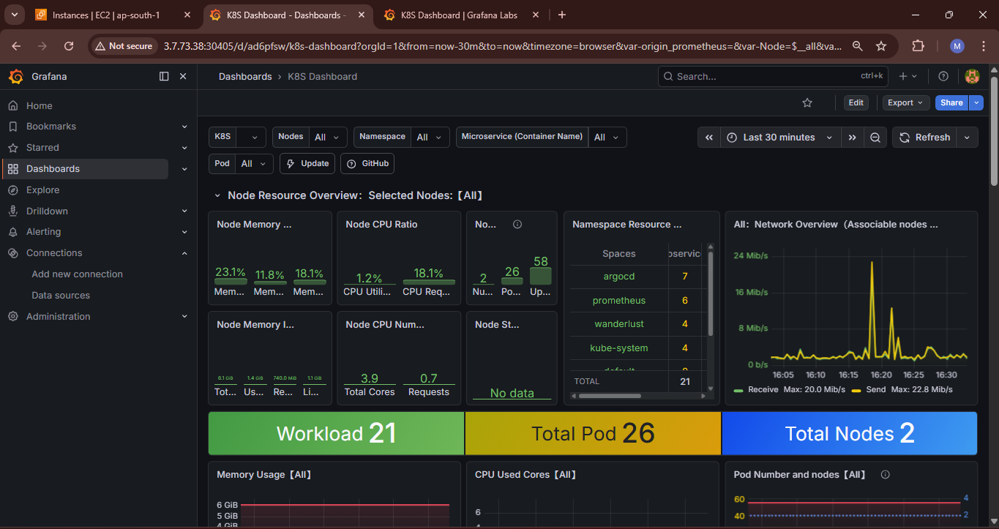
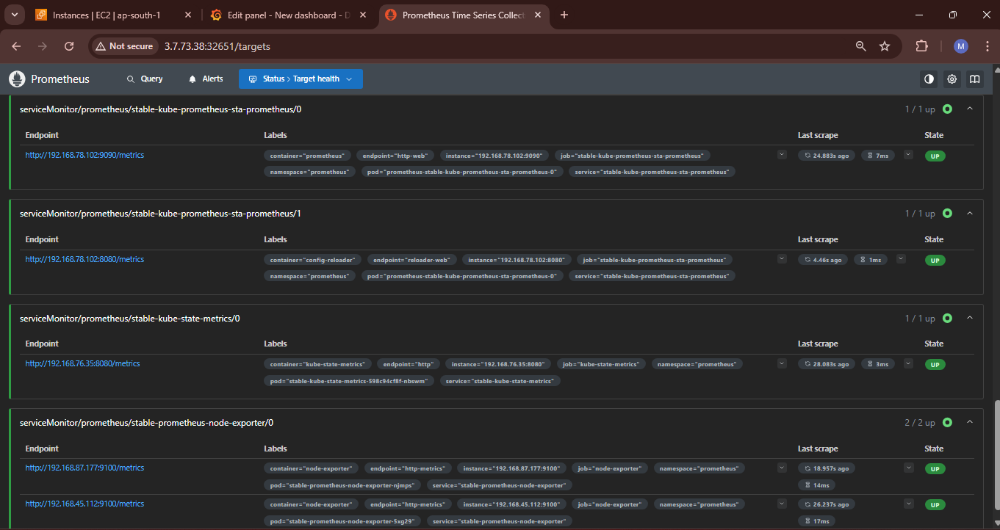

# 🚀 End-To-End DevSecOps Implementation on AWS EKS 

This project shows how I implemented a complete DevSecOps pipeline for a 3-tier MERN application and deployed it on AWS EKS.

I built this project to understand how real-world DevOps works using:

- CI/CD automation

- Security scanning

- GitOps deployment

- Infrastructure as Code

- Monitoring

Everything is automated from code push → build → scan → deploy → monitor.

## 🧭 Project Architecture


## ⚙️ Tools & Technologies Used
- GitHub – Source Code

- Terraform – Infrastructure creation

- Jenkins – CI/CD automation

- Docker – Containerization

- AWS EKS – Kubernetes cluster

- ArgoCD – GitOps deployment

- SonarQube – Code quality

- OWASP – Dependency check

- Trivy – Image security scan

- Helm – Monitoring setup

- Prometheus – Metrics

- Grafana – Dashboard

## 🔁 CI Pipeline

When code is pushed to GitHub:

- Jenkins pipeline starts automatically

- Runs security checks (OWASP, SonarQube)

- Builds Docker image

- Scans image using Trivy

- Pushes image to DockerHub



## 🚀 CD Pipeline

- Jenkins updates the new image version

- GitOps flow is triggered

- ArgoCD deploys the application to EKS automatically



## 🔄 ArgoCD Deployment

ArgoCD continuously monitors GitHub repo and syncs the application with EKS cluster.




## 🌐 Application Output
Application successfully deployed on AWS EKS.



## 📊 Monitoring Setup
Prometheus & Grafana installed using Helm charts for:

- Cluster health

- Application performance

- Resource usage
  



## 🛠 Infrastructure Setup using Terraform
Terraform was used to create EC2 infrastructure.
```
terraform init
terraform plan
terraform apply
```
## ☸️ Create EKS Cluster
```
eksctl create cluster --name traveltales-cluster --region ap-south-1
```
## 🐳 Docker Commands
Build image:
```
docker build -t app-image .
```
Push to DockerHub:
```
docker push username/app-image
```
## 🔍 Security Scanning
Run Trivy scan:
```
trivy image username/app-image
```
## 🔄 ArgoCD Setup
Create namespace:
```
kubectl create namespace argocd
```
Install ArgoCD:
```
kubectl apply -n argocd -f https://raw.githubusercontent.com/argoproj/argo-cd/stable/manifests/install.yaml
```
Check pods:
```
kubectl get pods -n argocd
```
## 📈 Monitoring using Helm
Install Helm:
```
curl https://raw.githubusercontent.com/helm/helm/main/scripts/get-helm-3 | bash
```
Add repo:
```
helm repo add prometheus-community https://prometheus-community.github.io/helm-charts
```
Install Prometheus & Grafana:
```
kubectl create namespace monitoring
helm install monitoring prometheus-community/kube-prometheus-stack -n monitoring
```
## 🧹 Clean Up
Delete cluster:
eksctl delete cluster --name traveltales --region ap-south-1

## 📌 Conclusion

This project helped me understand real-world DevSecOps workflow including:

- Infrastructure automation

- CI/CD pipelines

- Security integration

- GitOps deployment

- Kubernetes monitoring

