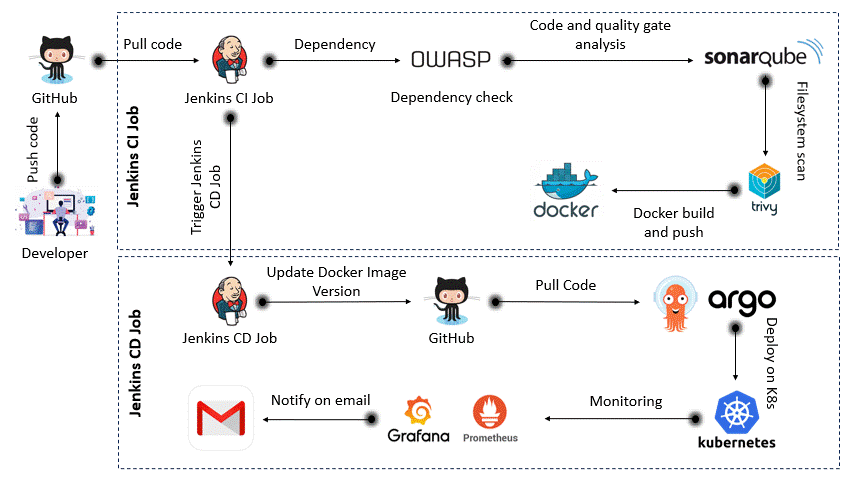

# 🚀 End-To-End DevSecOps Implementation on AWS EKS 

This project shows how I implemented a complete DevSecOps pipeline for a 3-tier MERN application and deployed it on AWS EKS.

I built this project to understand how real-world DevOps works using:

- CI/CD automation

- Security scanning

- GitOps deployment

- Infrastructure as Code

- Monitoring

Everything is automated from code push → build → scan → deploy → monitor.

## 🧭 Project Architecture

## ⚙️ Tools & Technologies Used
- GitHub – Source Code

- Terraform – Infrastructure creation

- Jenkins – CI/CD automation

- Docker – Containerization

- AWS EKS – Kubernetes cluster

- ArgoCD – GitOps deployment

- SonarQube – Code quality

- OWASP – Dependency check

- Trivy – Image security scan

- Helm – Monitoring setup

- Prometheus – Metrics

- Grafana – Dashboard
